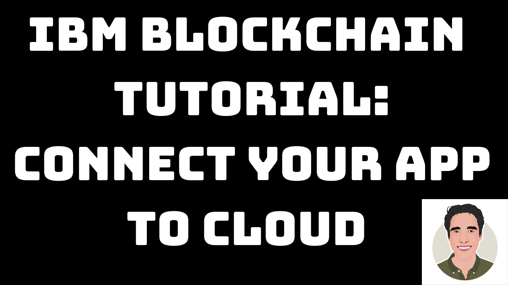
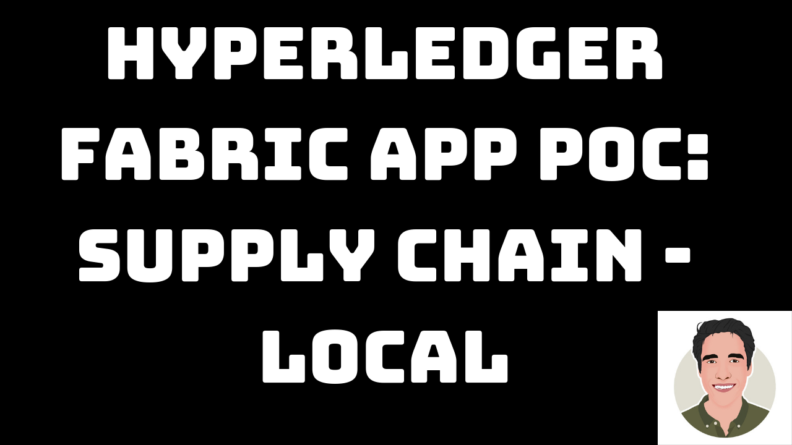
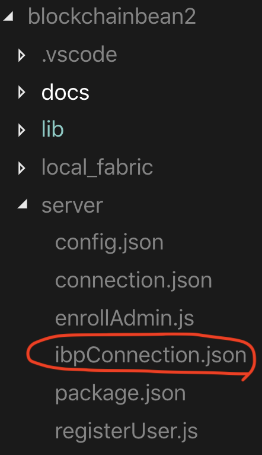

<!-- [](https://travis-ci.org/IBM/blockchainbean) -->

# Create a fair trade supply network with Hyperledger Fabric and IBM Blockchain Platform 2.0 Beta

To try the supply chain network API - go here: http://blockchainbeans2.mybluemix.net/


This code pattern is based on a recent proof-of-concept developed in collaboration with a coffee roasting company that was nice enough to let us use their supply-chain documents. The finished product of this code pattern is a cloud-based blockchain API, that any other UI app can call. An example UI app that leverages our blockchain API can be found [here](https://www.ibm.com/thought-leadership/blockchainbean/).


Each cup has a history based on which batch of coffee was used make the cup, which you 
can see below. Additionally, you can see other details such as who poured the cup, 
at what time the cup was poured, which type of beans were used, etc. on the [your cup](https://www.ibm.com/thought-leadership/blockchainbean/yourcup/index.html)
page. Hint, try cupId 'NJB123' for the result shown below.


All documents that were used in the supply chain are available online, and can be found by clicking the view the blockchain button at https://www.ibm.com/thought-leadership/blockchainbean/

In this code pattern we will create a blockchain app that increases visibility and efficiency in the supply chain of a coffee retailer using IBM Blockchain Platform 2.0 Beta. We will use different transactions to show different possible actions for the different participants in the supply chain. This sample application will record all transactions on the IBM Blockchain V2 Beta, and enable a coffee retailer to ensure the customer that their coffee is organic and fair-trade. The code pattern can be useful to developers that are looking into learning more about creating applications that integrate supply chains with Hyperledger Fabric.

When the reader has completed this code pattern, they will understand how to:

* Interact with the (free) IBM Blockchain Platform V2 Beta
* Build a blockchain back-end using Hyperledger Fabric
* Create and use a (free) Kubernetes Cluster
* Deploy a Node.js app in the cloud that will interact with our smart contract

# Flow Diagram
<br>
<p align="center">
  
</p>
<br>

# Flow Description
1. User submits transactions in the web UI.
2. The transaction is submitted to the Cloud Foundry application, connected to the IBM Blockchain Platform 2.0.
3. If the transaction conforms to the business logic, the ledger is updated and a block is appended to our chain.

# Included components
*	[IBM Blockchain Platform 2.0](https://console.bluemix.net/docs/services/blockchain/howto/ibp-v2-deploy-iks.html#ibp-v2-deploy-iks) gives you total control of your blockchain network with a user interface that can simplify and accelerate your journey to deploy and manage blockchain components on the IBM Cloud Kubernetes Service.
*	[IBM Cloud Kubernetes Service](https://www.ibm.com/cloud/container-service) gcreates a cluster of compute hosts and deploys highly available containers. A Kubernetes cluster lets you securely manage the resources that you need to quickly deploy, update, and scale applications.
* [IBM Blockchain Platform Extension for VS Code](https://marketplace.visualstudio.com/items?itemName=IBMBlockchain.ibm-blockchain-platform) is designed to assist users in developing, testing, and deploying smart contracts -- including connecting to Hyperledger Fabric environments.

## Featured technologies
+ [Hyperledger Fabric v1.4](https://hyperledger-fabric.readthedocs.io) is a platform for distributed ledger solutions, underpinned by a modular architecture that delivers high degrees of confidentiality, resiliency, flexibility, and scalability.
+ [Node.js](https://nodejs.org) is an open source, cross-platform JavaScript run-time environment that executes server-side JavaScript code.
+ [Loopback 4](https://v4.loopback.io/) LoopBack is a highly-extensible, open-source Node.js framework that enables you to: Create dynamic end-to-end REST APIs with little or no coding. Access data from major relational databases, MongoDB, SOAP and REST APIs. Incorporate model relationships and access controls for complex APIs.

# Watch the Video - Create a fair trade supply network with Hyperledger Fabric 1.4 (Cloud)

[](https://www.youtube.com/watch?v=8wtHsD7-kS4)

# Watch the Video - Create a fair trade supply network with Hyperledger Fabric 1.4 (Local)

[](https://www.youtube.com/watch?v=mG2TCIPlvk0)

## Prerequisites

This pattern assumes you have an **IBM Cloud account**, **VSCode** and **IBM Blockchain Platform Extension for VSCode installed**

- [IBM Cloud account](https://cloud.ibm.com/registration/?target=%2Fdashboard%2Fapps)
- [Install VSCode](https://code.visualstudio.com/download)
- [Install IBM Blockchain Platform Extension for VSCode](https://github.com/IBM-Blockchain/blockchain-vscode-extension)
- [Node v8.x or greater and npm v5.x or greater](https://nodejs.org/en/download/)

# Steps (Cloud Deployment)
> To run a local network, you can find steps [here](./docs/run-local.md).
1. [Clone the Repo](#step-1-clone-the-repo)
2. [Install Dependencies](#step-2-install-dependencies)
3. [Package Contract](#step-3-package-contract)
4. [Create IBM Cloud services](#step-4-create-ibm-cloud-services)
5. [Build a network](#step-5-build-a-network)
6. [Deploy blockchainbean2 Smart Contract on the network](#step-6-deploy-blockchainbean2-smart-contract-on-the-network)
7. [Connect application to the network](#step-7-connect-application-to-the-network)
8. [Run the application](#step-8-run-the-application)

## Step 1. Clone the Repo

Git clone this repo onto your computer in the destination of your choice, then go into the web-app folder:
```
HoreaPorutiu$ git clone https://github.com/horeaporutiu/blockchainbean2.git
```
Navigate to the `web-app` directory:
```
HoreaPorutiu$ cd blockchainbean2/web-app
```

## Step 2. Install Dependencies

Install required dependencies using NPM:
```
web-app$ npm install --ignore-scripts
```

## Step 3. Package Contract


Right-click under your folders in your workspace area and then click *Add Folder to Workspace* and then highlight the 
`blockchainbean/lib` directory as shown in the picture below, and then click on *add*:


 Next, we have to package the smart contract. Click on the *F1* button on your keyboard,
 which will bring up the VSCode command pallete. From there, navigate and click on `Package a Smart Contract Project`.


 Next, the extension will ask the following question:
 ```
 Choose a workspace folder to package
 ```
 Click on the *lib* folder - note we do not want to package our client (i.e. our web-app directory).

  

 If all went well, you should see the following. 

  
 
 Note that this `.cds` file is extremely important if we want to run 
 our smart contract on the cloud. 

## Step 4. Create IBM Cloud services

* Create the [IBM Cloud Kubernetes Service](https://cloud.ibm.com/catalog/infrastructure/containers-kubernetes).  You can find the service in the `Catalog`.  For this code pattern, we can use the `Free` cluster, and give it a name.  Note, that the IBM Cloud allows one instance of a free cluster and expires after 30 days. <b>The cluster takes around 10-15
minutes to provision, so please be patient!</b>

<br>
<p align="center">
  
</p>
<br>

* Create the [IBM Blockchain Platform 2.0](https://console.bluemix.net/catalog/services/blockchain/) service on the IBM Cloud.  You can find the service in the `Catalog`, and give a name.

<br>
<p align="center">
  
</p>
<br>

* After your kubernetes cluster is up and running, you can deploy your IBM Blockchain Platform on the cluster.  The service walks through few steps and finds your cluster on the IBM Cloud to deploy the service on.

<br>
<p align="center">
  
</p>
<br>

* Once the Blockchain Platform is deployed on the Kubernetes cluster, you can launch the console to start operating on your blockchain network.

<br>
<p align="center">
  
</p>
<br>

## Step 5. Build a network

We will build a network as provided by the IBM Blockchain Platform [documentation](https://console.bluemix.net/docs/services/blockchain/howto/ibp-console-build-network.html#ibp-console-build-network).  This will include creating a channel with a single peer organization with its own MSP and CA (Certificate Authority), and an orderer organization with its own MSP and CA. We will create the respective identities to deploy peers and operate nodes.

### Create your organization and your entry point to your blockchain

* #### Create your peer organization CA
  - Click <b>Add Certificate Authority</b>.
  - Click <b>IBM Cloud</b> under <b>Create Certificate Authority</b> and <b>Next</b>.
  - Give it a <b>Display name</b> of `Org1 CA`.  
  - Specify an <b>Admin ID</b> of `admin` and <b>Admin Secret</b> of `adminpw`.

<br>
<p align="center">
  
</p>
<br>


* #### Use your CA to register identities
  - Select the <b>Org 1 CA</b> Certificate Authority that we created.
  - First, we will register an admin for our organization "org1". Click on the <b>Register User</b> button.  Give an <b>Enroll ID</b> of `org1admin`, and <b>Enroll Secret</b> of `org1adminpw`.  Click <b>Next</b>.  Set the <b>Type</b> for this identity as `client` and select `org1` from the affiliated organizations drop-down list. We will leave the <b>Maximum enrollments</b> and <b>Add Attributes</b> fields blank.
  - We will repeat the process to create an identity of the peer. Click on the <b>Register User</b> button.  Give an <b>Enroll ID</b> of `peer1`, and <b>Enroll Secret</b> of `peer1pw`.  Click <b>Next</b>.  Set the <b>Type</b> for this identity as `peer` and select `org1` from the affiliated organizations drop-down list. We will leave the <b>Maximum enrollments</b> and <b>Add Attributes</b> fields blank.

<br>
<p align="center">
  
</p>
<br>


* #### Create the peer organization MSP definition
  - Navigate to the <b>Organizations</b> tab in the left navigation and click <b>Create MSP definition</b>.
  - Enter the <b>MSP Display name</b> as `Org1 MSP` and an <b>MSP ID</b> of `org1msp`.
  - Under <b>Root Certificate Authority</b> details, specify the peer CA that we created `Org1 CA` as the root CA for the organization.
  - Give the <b>Enroll ID</b> and <b>Enroll secret</b> for your organization admin, `org1admin` and `org1adminpw`. Then, give the Identity name, `Org1 Admin`.
  - Click the <b>Generate</b> button to enroll this identity as the admin of your organization and export the identity to the wallet. Click <b>Export</b> to export the admin certificates to your file system. Finally click <b>Create MSP definition</b>.

<br>
<p align="center">
  
</p>
<br>


* Create a peer
  - On the <b>Nodes</b> page, click <b>Add peer</b>.
  - Click <b>IBM Cloud</b> under Create a new peer and <b>Next</b>.
  - Give your peer a <b>Display name</b> of `Peer Org1`.
  - On the next screen, select `Org1 CA` as your <b>Certificate Authority</b>. Then, give the <b>Enroll ID</b> and <b>Enroll secret</b> for the peer identity that you created for your peer, `peer1`, and `peer1pw`. Then, select the <b>Administrator Certificate (from MSP)</b>, `Org1 MSP`, from the drop-down list and click <b>Next</b>.
  - Give the <b>TLS Enroll ID</b>, `admin`, and <b>TLS Enroll secret</b>, `adminpw`, the same values are the Enroll ID and Enroll secret that you gave when creating the CA.  Leave the <b>TLS CSR hostname</b> blank.
  - The last side panel will ask you to <b>Associate an identity</b> and make it the admin of your peer. Select your peer admin identity `Org1 Admin`.
  - Review the summary and click <b>Submit</b>.

<br>
<p align="center">
  
</p>
<br>

### Create the node that orders transactions

* #### Create your orderer organization CA
  - Click <b>Add Certificate Authority</b>.
  - Click <b>IBM Cloud</b> under <b>Create Certificate Authority</b> and <b>Next</b>.
  - Give it a unique <b>Display name</b> of `Orderer CA`.  
  - Specify an <b>Admin ID</b> of `admin` and <b>Admin Secret</b> of `adminpw`.

<br>
<p align="center">
  
</p>
<br>

* #### Use your CA to register orderer and orderer admin identities
  - In the <b>Nodes</b> tab, select the <b>Orderer CA</b> Certificate Authority that we created.
  - First, we will register an admin for our organization. Click on the <b>Register User</b> button.  Give an <b>Enroll ID</b> of `ordereradmin`, and <b>Enroll Secret</b> of `ordereradminpw`.  Click <b>Next</b>.  Set the <b>Type</b> for this identity as `client` and select `org1` from the affiliated organizations drop-down list. We will leave the <b>Maximum enrollments</b> and <b>Add Attributes</b> fields blank.
  - We will repeat the process to create an identity of the orderer. Click on the <b>Register User</b> button.  Give an <b>Enroll ID</b> of `orderer1`, and <b>Enroll Secret</b> of `orderer1pw`.  Click <b>Next</b>.  Set the <b>Type</b> for this identity as `peer` and select `org1` from the affiliated organizations drop-down list. We will leave the <b>Maximum enrollments</b> and <b>Add Attributes</b> fields blank.

<br>
<p align="center">
  
</p>
<br>


* #### Create the orderer organization MSP definition
  - Navigate to the <b>Organizations</b> tab in the left navigation and click <b>Create MSP definition</b>.
  - Enter the <b>MSP Display name</b> as `Orderer MSP` and an <b>MSP ID</b> of `orderermsp`.
  - Under <b>Root Certificate Authority</b> details, specify the peer CA that we created `Orderer CA` as the root CA for the organization.
  - Give the <b>Enroll ID</b> and <b>Enroll secret</b> for your organization admin, `ordereradmin` and `ordereradminpw`. Then, give the <b>Identity name</b>, `Orderer Admin`.
  - Click the <b>Generate</b> button to enroll this identity as the admin of your organization and export the identity to the wallet. Click <b>Export</b> to export the admin certificates to your file system. Finally click <b>Create MSP definition</b>.

<br>
<p align="center">
  
</p>
<br>

* #### Create an orderer
  - On the <b>Nodes</b> page, click <b>Add orderer</b>.
  - Click <b>IBM Cloud</b> and proceed with <b>Next</b>.
  - Give your peer a <b>Display name</b> of `Orderer`.
  - On the next screen, select `Orderer CA` as your <b>Certificate Authority</b>. Then, give the <b>Enroll ID</b> and <b>Enroll secret</b> for the peer identity that you created for your orderer, `orderer1`, and `orderer1pw`. Then, select the <b>Administrator Certificate (from MSP)</b>, `Orderer MSP`, from the drop-down list and click <b>Next</b>.
  - Give the <b>TLS Enroll ID</b>, `admin`, and <b>TLS Enroll secret</b>, `adminpw`, the same values are the Enroll ID and Enroll secret that you gave when creating the CA.  Leave the <b>TLS CSR hostname</b> blank.
  - The last side panel will ask to <b>Associate an identity</b> and make it the admin of your peer. Select your peer admin identity `Orderer Admin`.
  - Review the summary and click <b>Submit</b>.

<br>
<p align="center">
  
</p>
<br>

* #### Add organization as Consortium Member on the orderer to transact
  - Navigate to the <b>Nodes</b> tab, and click on the <b>Orderer</b> that we created.
  - Under <b>Consortium Members</b>, click <b>Add organization</b>.
  - From the drop-down list, select `Org1 MSP`, as this is the MSP that represents the peer's organization org1.
  - Click <b>Submit</b>.

<br>
<p align="center">
  
</p>
<br>


### Create and join channel

* #### Create the channel
  - Navigate to the <b>Channels</b> tab in the left navigation.
  - Click <b>Create channel</b>.
  - Give the channel a name, `mychannel`.
  - Select the orderer you created, `Orderer` from the orderers drop-down list.
  - Select the MSP identifying the organization of the channel creator from the drop-down list. This should be `Org1 MSP (org1msp)`.
  - Associate available identity as `Org1 Admin`.
  - Click <b>Add</b> next to your organization. Make your organization an <b>Operator</b>.
  - Click <b>Create</b>.

<br>
<p align="center">
  
</p>
<br>


* #### Join your peer to the channel
  - Click <b>Join channel</b> to launch the side panels.
  - Select your `Orderer` and click <b>Next</b>.
  - Enter the name of the channel you just created. `mychannel` and click <b>Next</b>.
  - Select which peers you want to join the channel, click `Peer Org1` .
  - Click <b>Submit</b>.

<br>
<p align="center">
  
</p>
<br>

## Step 6. Deploy Blockchainbean2 Smart Contract on the network

* #### Install a smart contract
  - Click the <b>Smart contracts</b> tab to install the smart contract.
  - Click <b>Install smart contract</b> to upload the blockchainbean smart contract package file, which you packaged earlier using the Visual Studio code extension **look above at the end of step 3**.
  - Click on <b>Add file</b> and find your packaged smart contract.  
  - Once the contract is uploaded, click <b>Install</b>.


<br>
<p align="center">
  
</p>
<br>

* #### Instantiate smart contract
  - On the smart contracts tab, find the smart contract from the list installed on your peers and click <b>Instantiate</b> from the overflow menu on the right side of the row.
  - On the side panel that opens, select the channel, `mychannel` to instantiate the smart contract on. Click <b>Next</b>.
  - Select the organization members to be included in the policy, `org1msp`.  Click <b>Next</b>.
  - Give <b>Function name</b> of `init` and leave <b>Arguments</b> blank.
  - Click <b>Instantiate</b>.

<br>
<p align="center">
  
</p>
<br>

## Step 7. Connect application to the network

* #### Connect with sdk through connection profile
  - Under the Instantiated Smart Contract, click on `Connect with SDK` from the overflow menu on the right side of the row.
  - Choose from the dropdown for <b>MSP for connection</b>, `org1msp`.
  - Choose from <b>Certificate Authority</b> dropdown, `Org1 CA`.
  - Download the connection profile by scrolling down and clicking <b>Download Connection Profile</b>.  This will download the connection json which we will use soon to establish connection.
  - You can click <b>Close</b> once the download completes.

<br>
<p align="center">
  
</p>
<br>

* #### Create an application admin
  - Go to the <b>Nodes</b> tab on the left bar, and under <b>Certifacte Authorities</b>, choose your organization CA, <b>Org1 CA</b>.
  - Click on <b>Register user</b>.
  - Give an <b>Enroll ID</b> and <b>Enroll Secret</b> to administer your application users, `app-admin` and `app-adminpw`.
  - Choose `client` as <b>Type</b> and any organization for affiliation.  We can pick `org1` to be consistent.
  - You can leave the <b>Maximum enrollments</b> blank.
  - Under <b>Attributes</b>, click on <b>Add attribute</b>.  Give attribute as `hf.Registrar.Roles` = `*`.  This will allow this identity to act as registrar and issues identities for our app.  Click <b>Add-attribute</b>.
  - Click <b>Register</b>.

<br>
<p align="center">
  
</p>
<br>


* #### Update application connection
  - Copy the connection profile you downloaded into [server folder](server)
  - Name the connection profile you downloaded **ibpConnection.json**
  - Your new folder structure should look like below (i.e. should have your newly downloaded and newly renamed file **ibpConnection.json**: 

  <p align="center">
    
  </p>

  - The **ibpConnection.json** file should look something like this: 

   <p align="center">
    
  </p>

  - Update the [config.json](server/config.json) file with:
    - The connection json file name you downloaded.
    - The <b>enroll id</b> and <b>enroll secret</b> for your app admin, which we earlier provided as `app-admin` and `app-adminpw`.
    - The orgMSP ID, which we provided as `org1msp`.
    - The caName, which can be found in your connection json file under "organization" -> "org1msp" -> certificateAuthorities". This would be like an IP address and a port. This is circled in red above.
    - The username you would like to register.
    - Update gateway discovery to `{ enabled: true, asLocalhost: false }` to connect to IBP.

> the current default setup is to connect to a local fabric instance from VS Code

- Once you are done, the final version of the **config.json** should look something like this (note that I took the caName from the above pic):

```js
{
    "connection_file": "ibpConnection.json",
    "appAdmin": "app-admin",
    "appAdminSecret": "app-adminpw",
    "orgMSPID": "org1msp",
    "caName": "173.193.106.28:32634",
    "userName": "user1",
    "gatewayDiscovery": { "enabled": true, "asLocalhost": false }
}
```


## Step 8. Run the application

* #### Enroll admin
  - First, navigate to the `server` directory, and install the node dependencies.
    ```bash
    cd server
    npm install
    ```
  - ⚠️ if you get a grpc error run:
    ```bash
    npm rebuild
    ```
  
  - Run the `enrollAdmin.js` script
    ```bash
    node enrollAdmin.js
    ```

  - You should see the following in the terminal:
    ```bash
    msg: Successfully enrolled admin user app-admin and imported it into the wallet
    ```

* #### Register User
  - Run the `registerUser.js` script.
    ```bash
    node registerUser.js
    ```

  - You should see the following in the terminal:
    ```bash
    Successfully registered and enrolled admin user user1 and imported it into the wallet
    ```
  - If you get an error such as this 
  
  ```Error: fabric-ca request register failed with errors [[{"code":0,"message":"Registration of 'user1' failed: Identity 'user1' is already registered"}]]```

  go ahead and change the user in **config.json** file, you can use any
  username you want.


* #### Start the web client
  - In a new terminal, open the web-app folder from the room blockchainbean2 directory.
    ```bash
    cd web-app
    ```

  - Start the client:
    ```bash
    npm start
    ```


You can find the app running at http://localhost:3000/explorer  If all goes well, you should see something like the picture below: 


To get started submitting our first transaction on the network, we can update the ledger 
with some of our suppliers info, such as their address, their uniqueId, and their 
organization. To do this, first  click on `GrowerController`. You should see the Controller 
expand with the GET/POST methods. Click on the green `POST/Grower` button and then `Try it out` to 
the right of the `POST/Grower` button. This will enable you to write in a request body. Go ahead 
and copy and paste the following JSON in to the request body. P.S. (I have made all the commands 
available in the commands.txt file).

```json
{
  "$class": "org.ibm.coffee.Grower",
  "isFairTrade": true,
  "growerId": "Grower-0201",
  "organization": "Ethiopia Gedeb 1 Banko Gotiti GrainPro",
  "address": {
    "$class": "org.ibm.coffee.Address",
    "city": "Gedeb",
    "country": "Ethiopia",
    "street": "N/A",
    "zip": "N/A"
  }
}
```
Then click the blue Execute button under the request body. If all goes well, you should see something similar to the image below:


If all went well, you can now go into your blockchain network, click on the channel, and then
you should see the block height increased, and if you click on the last block, you should
see the latest JSON that we inputted being written to the blockchain. **Note:** The gif shows
how to get to your channel and transaction overview. Your transaction data should be different - 
it should show updating the ledger with the information of `Grower-0201`.

<br>
<p align="center">
  
</p>
<br>

The rest of the commands for uploading supply chain documents can be 
found [here.](https://github.com/horeaporutiu/blockchainbean2/blob/master/docs/run-local.md#add-members-to-the-network)

## Bonus Step - Deploy your local app to the Cloud
If you want to keep your application running all the time, 
you'll want to deploy it to the cloud. The goal is to deploy
something like this: http://blockchainbeans2.mybluemix.net/

To do this, please follow the guide [here:](https://medium.com/loopback/deploy-your-first-loopback4-application-to-ibm-cloud-2e671ac06b6c)


## Conclusion

So yes! Go ahead and run the /POST transactions as shown in 
[these steps](https://github.com/horeaporutiu/blockchainbean2/blob/master/docs/run-local.md#step-6-submit-transactions), and
 everything will be stored on the IBM Blockchain Platform. So now, you are 
 officialy done with this tutorial. So what did you learn?

1. You learned how to create a smart contract project with the IBM Blockchain VSCode extension.
2. You learned how to deploy your smart contract on a local Hyperledger Fabric network.
3. You learned how to update the ledger by submitting transactions to the network.
4. You learned that Hyperledger stores data as key-value pairs, so to look up data on the network, you need to pass in a key that has a value associated with it. We did that by running the query method.
5. You learned how to create a Kubernetes Cluster and IBM Blockchain service and to connect our client Loopback application to our cloud service via the connection profile we downloaded.
6. You learned how to view the ledger of a specific channel, by clicking on the channel, the ledger, and then the individual transactions. 

So at this point, you know more than me! Hopefully you feel pretty good at this point, and can dive a bit deeper into other, more complex topics, such as how to scale your network, how to optimize performance, etc. But for now, you know all of the basics to run a supply chain network on Hyperledger Fabric, both locally, and on the Cloud.

GREAT JOB! YOU DID IT! :) 

And when you create the cool new startup unicorn after learning a bunch from this tutorial, don't forget to give me, or IBM Developer some credit :) 

## Troubleshooting
If you are getting errors with your IBM Blockchain VSCode extension, ensure 
you have all prerequisites installed here: https://github.com/IBM-Blockchain/blockchain-vscode-extension#requirements

## Related Links
* [Hyperledger Fabric Docs](http://hyperledger-fabric.readthedocs.io/en/latest/)
* [IBM Code Patterns for Blockchain](https://developer.ibm.com/patterns/category/blockchain/)

## License
This code pattern is licensed under the Apache Software License, Version 2. Separate third-party code objects invoked within this code pattern are licensed by their respective providers pursuant to their own separate licenses. Contributions are subject to the [Developer Certificate of Origin, Version 1.1 (DCO)](https://developercertificate.org/) and the [Apache Software License, Version 2](https://www.apache.org/licenses/LICENSE-2.0.txt).

[Apache Software License (ASL) FAQ](https://www.apache.org/foundation/license-faq.html#WhatDoesItMEAN)

