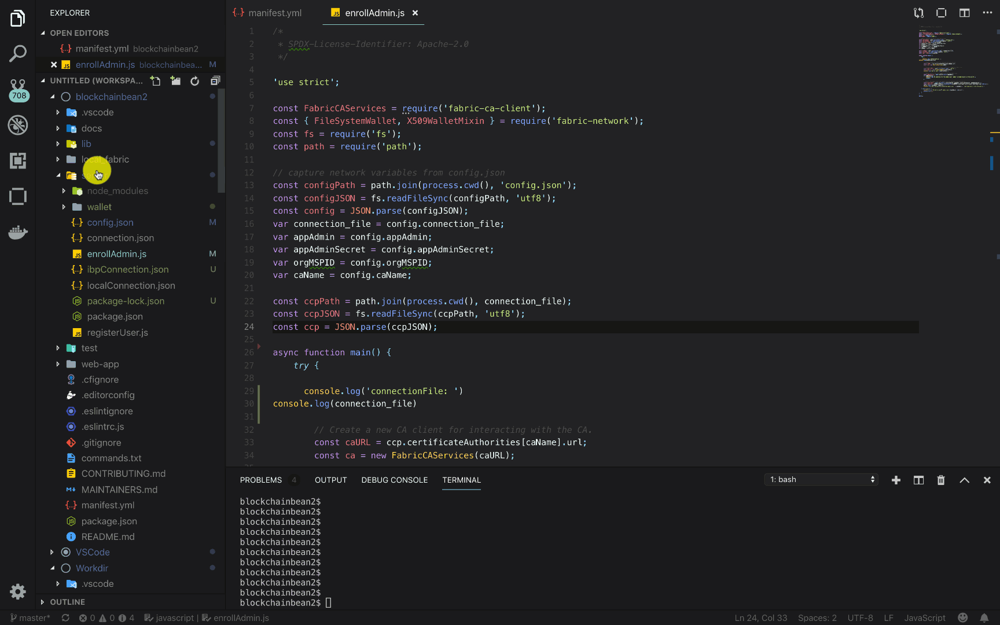

## Bonus Step - Deploy your local app to the Cloud
If you want to keep your application running all the time, 
you'll want to deploy it to the cloud. The goal is to deploy
something like this: http://blockchainbeans2.mybluemix.net/

 

  

 

1. In your `blockchainbean2` directory, open the `manifest.yml` file. Change
the app name to whatever you wish. I called mine testApp123667. When you run the `cf push` command,
this is the file that will be looked at to create the public
route where you will go to visit the app. For example,
if I called the app `testApp123667` then the full domain that 
will be available after the deployment will be `testApp123667.mybluemix.net`
2. Next, use the `cf login` command to login to IBM Cloud.
(I use `cf login --sso` since I have a IBMid).
3. Once you are logged in, pick your org and space where you want to deploy
you app. Your org and space will be different than mine.

 

  

 

4. Lastly, use `cf push` to push your newly named app to the IBM Cloud. The `cf push` command will look at the directory
which has the `manifest.yml` file and then look for a `package.json` file to install all required dependencies for 
your application. If there are problems with your deployment, but the app is working correcly when you run it locally, it will likely be due to either the `manifest.yml` or `package.json` file.

5. Once 
that app is deployed, go ahead and open the URL, click on the API Explorer, and submit a /POST/Grower 
transaction.
If everything went well, you should have a app running in the Cloud, with 
all transactions logged on the IBM Blockchain Platform. Congrats!