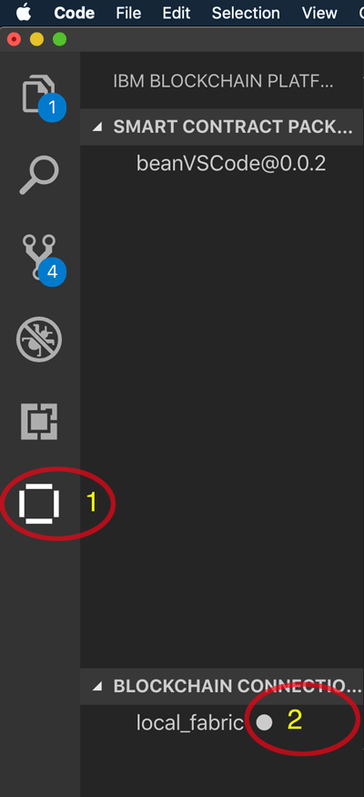
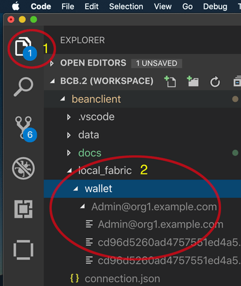

# Create a fair trade supply network with Hyperledger Composer and IBM Blockchain Starter Plan

This code pattern is based on a recent proof-of-concept developed in collaboration with
a coffee roasting company that was nice enough to let us use their supply-chain documents.
The link to the application that the code pattern is based off of is here: https://www.ibm.com/thought-leadership/blockchainbean/

All documents that were used in the supply chain are available online, and can be found by clicking the
`view the blockchain` button at https://www.ibm.com/thought-leadership/blockchainbean/

In this Code Pattern we will create a blockchain app that increases visibility and efficiency in the supply chain of a coffee retailer. The private keys and credentials of the blockchain application will be stored on a Cloudant database. We will use different transactions to show different possible actions for the different participants in the supply chain. This sample application will record all transactions on the IBM Blockchain Starter Plan, and enable a coffee retailer to ensure the customer that their coffee is organic and fair-trade. The Code Pattern can be useful to developers that are looking into learning more about creating applications that mimic a food trust supply chain with Hyperledger Composer.

When the reader has completed this Code Pattern, they will understand how to:


* Package and deploy the smart contract to a local instance of Hyperledger Fabric using IBM Blockchain Platform Extension for VS Code
* Develop a Node.js blockchain loopback enabled REST endpoints to interact with the deployed Fabric network
* Interact with IBM Blockchain Starter Plan
* Create and use Cloudant NoSQL Database
* Deploy a Cloud Foundry application that writes and queries to the ledger

<!--Remember to dump an image in this path-->


## Flow
1. User submits transaction proposal using a web-app.
2. The web-app talks to a REST API which is running on Cloud Foundry.
3. The REST API invokes chaincode on the peers of the blockchain network.
4. The peers sign the transaction with their certificates which are held in Cloudant. The ledger is updated on the peers.

## Included components


* [IBM Blockchain Platform Extension for VS Code](https://marketplace.visualstudio.com/items?itemName=IBMBlockchain.ibm-blockchain-platform) is designed to assist users in developing, testing, and deploying smart contracts -- including connecting to Hyperledger Fabric environments.
* [Hyperledger Fabric v1.4](https://hyperledger-fabric.readthedocs.io) is a platform for distributed ledger solutions, underpinned by a modular architecture that delivers high degrees of confidentiality, resiliency, flexibility, and scalability.
* [Visual Studio Code](https://code.visualstudio.com/download) is a code editor that's redefined and optimized for building and debugging modern web and cloud applications.
* [IBM Blockchain Starter Plan](https://console.bluemix.net/catalog/services/blockchain): Use the IBM Blockchain Platform to simplify the developmental, governmental, and operational aspects of creating a blockchain solution.
* [Cloudant NoSQL DB](https://console.ng.bluemix.net/catalog/services/cloudant-nosql-db): A fully managed data layer designed for modern web and mobile applications that leverages a flexible JSON schema.

## Featured technologies
+ [Node.js](https://nodejs.org/en/) is an open source, cross-platform JavaScript run-time environment that executes server-side JavaScript code.
+ [Loopback 4](https://loopback.io/) is a NodeJS REST API framework.

* [IBM Blockchain](https://www.ibm.com/blockchain): Blockchain is a shared, immutable ledger for recording the history of transactions.
* [Databases](https://en.wikipedia.org/wiki/IBM_Information_Management_System#.22Full_Function.22_databases): Repository for storing and managing collections of data.
* [Cloud](https://www.ibm.com/developerworks/learn/cloud/): Accessing computer and information technology resources through the Internet.

## Prerequisites
You will need to follow the requirements for the [IBM Blockchain Platform Extension for VS Code](https://github.com/IBM-Blockchain/blockchain-vscode-extension/blob/master/README.md#requirements):

- [VSCode version 1.26 or greater](https://code.visualstudio.com)
- [Node v8.x or greater and npm v5.x or greater](https://nodejs.org/en/download/)
- [Yeoman (yo) v2.x](http://yeoman.io/)
- [Docker version v17.06.2-ce or greater](https://www.docker.com/get-docker)
- [Docker Compose v1.14.0 or greater](https://docs.docker.com/compose/install/)

- Loopback v4 to generate app skeleton.

```
$ npm install -g @loopback/cli
```

# Steps
## Development on your local environment
1. [Install IBM Blockchain VS Code Extension](#step-1-Install-IBM-Blockchain-VS-Code-Extension)

2. [Clone the Smart Contract repo](#step-2-clone-the-smartcontract-repo)

3. [Package, Install and run the Smart Contract code](#step-3-package-install-run-smart-contract)

4. [Clone the BlockBean Client repo](#step-4-clone-the-BlockBean-Client-repo)

5. [Export your wallet to BlockBean Client](#step-5-Export-your-wallet-to-BlockBean-Client)

6. [Adding a new API endpoint to the BlockBean Client](#step-6-Adding-a-new-API-endpoint-to-the-BlockBean-Client)

7. [Wire up Loopback to Blockchain](#step-7-use-Loopback-to-connect-to-blockchain)

8. [Use Swagger Explorer to call REST API](#step-8-use-Swagger-to-call-REST-API)


## Remote deployment to IBM Cloud

1. [Package and run smart contract code](#step-4-push-smart-contract-code)

2. [Deploy smart contract to IBM Blockchain Starter Plan](#step-5-deploy-smart-contract-to-ibm-blockchain-starter-plan)

6. [Post transactions and query the Loopback REST Server (Swagger UI)](#step-6-post-transactions-and-query-the-composer-rest-server-swagger-ui)

3. [Launch IBM Blockchain Starter Plan](#step-7-launch-ibm-blockchain-starter-plan)

8. [Inspect blocks on IBM Blockchain Starter Plan](#step-8-inspect-blocks-on-ibm-blockchain-starter-plan)

9. [Submit fair trade supply data](#step-9-submit-fair-trade-supply-data)


<!-- the steps details -->

# Development on your local environment
Open Visual Studio code

## Step 1. Install IBM Blockchain VS Code Extension
Assuming you have installed VS Code.  Add the IBM Blockchain Platform Visual Studio Code extension.

## Step 2. Clone the Smart Contract repo
Clone this repository and open it in VS Code
```sh
$ git clone git@github.com:horeaporutiu/blockchainbean2.git
$ code .
```

## Step 3. Package, Install and run the Smart Contract code
Package mycontract.js ...

Install ...

Run / Test ...

## Step 4. Clone the BlockBean Client repo
Clone BlockBean Client repository

```sh
$ git clone git@github.com:Grant-Steinfeld/beanClientLoopBack.git
```

Add this folder to you Visual Studio Workspace
```sh
$ code .
```

## Step 5. Export your wallet to BlockBean Client
You will need to open the IBM Blockchain Platform Extension panel



1. Click on the Blockchain Extension Icon

2. Right mouse click on the local_fabric Icon
Then choose `Export Connection Details`
Save the wallet in the root folder of loopback project.

In the explorer panel(1), you should now see a new directory `local_fabric`(2) this is where the wallet for certificates for the Admin@org1.example.com will reside.



network.yaml - edit  ...


## Step 6. Adding a new API endpoint to the BlockBean Client
Explain Loopback code generation Model (lb4 model) and Cotroller (lb4 controller) commands

Controller add methods for GET and POST


## Step 7. Wire up Loopback to Blockchain
how to wire up to blockchainClient.ts

## Step 8. Use Swagger Explorer to call REST API

```sh
npm start
```

In your browser go to local
[swagger REST explorer  ](http://127.0.0.1:3000/explorer/#/)

By now you have completed the local development and testing of the BlockBean network and client, great, good job.

Now lets look at how to deploy this to the cloud.

# Remote

## Step 1. Create the toolchain

 


Go to https://github.com/sstone1/blockchain-starter-kit. Go to step 2, and click on `Set up DevOps toolchain`.

Follow steps in the in the README to create your DevOps toolchain, and GitHub repository. At the end of this step you should have a toolchain with a github repo, and a delivery pipeline, as shown in the last part of step 2 of https://github.com/sstone1/blockchain-starter-kit. Just refresh the toolchain page, and you should see your toolchain have 3 parts - think, code, delivery, as shown in the gif below.

## Step 2. Clone the repo


Now we need to clone the repo we have just created. Click on the Github button in the middle, which will take you to your new GitHub repo. Now, click on the green `clone or download` button on the right side of the page. This should give you a URL. Save this, you'll need it in the next step. Now in your terminal, find a place where you would like to start your project. In terminal, execute the following
```git clone https://github.com/<yourUsername/projectname>.git```

Go into your newly cloned repo. I called my bsk-horea-2.

```
$ cd bsk-horea-2
```

## Step 3. Use Loopback to scaffold your project

 

Now to the fun part, the smart contracts. Let's use Yeoman.


```
$ npm install -g generator-hyperledger-composer
$ npm install -g yo
$ cd contracts
$ yo
```
```
$ -> `Hyperledger Composer`
$ -> `Business Network`
$ Business network name: `coffeetracker4`
$ Description: `demo`
$ Author Name: `Horea`
$ Author Email: `horea@email.com`
$ License: `(Apache-2.0)`
$ Namespace: org.ibm.coffee
$ Do you want to generate an empty template network?: `Yes`
```

## Step 4. Push smart contract code


 

First, we need to modify some lines from your newly scaffoled application. Let's cut a few lines inside the `package.json` file. This is found in the
 `bsk-horea-2/contracts/package.json` file.

 Let's remove the lines that start with `pretest`, `lint`, and `test`.

 

 Next, let's first clone the blockchain bean
directory.
```
$ git clone https://github.com/IBM/blockchainbean.git
```

Next, copy and paste the `permissions.acl` file from
 `blockchainbean/contracts/coffeeTrackr/permissions.acl`
and overwrite your permissions.acl file created from yeoman.

 

Next, we'll copy the `queries.qry` file from
`blockchainbean/contracts/coffeeTrackr/queries.qry` and paste it
in our directory. We shouldn't have a `queries.qry` yet.

After that, let's rename our `bsk-horea-2/contracts/models/org.ibm.coffee.cto` file to
`bsk-horea-2/contracts/models/model.cto`, and copy and paste that same file from the
blockchainbean directory, as we have been doing.

The last file we need is `blockchainbean/contracts/coffeeTrackr/lib/logic.js` file,
and we can just grab that and paste the contents in `bsk-horea-2/contracts/lib/logic.js`.

 

Now, in terminal, let's push our code up to the GitHub repo with the following commands:
```
$ git add .
$ git commit -m "first commit"
$ git push origin master
```

## Step 5. Deploy smart contract to IBM Blockchain Starter Plan

 

Now, we need to check our toolchain that we created in Step 2.

Let's go back to our GitHub repo that we just created. Click on the link that says
 `Created for Toolchain:` in the title of the GitHub repo. You will be taken to your `IBM Cloud Toolchains` page.

Click on the `Delivery` stage.

The pipeline should be triggered now. If it is not, simply go to it, and press the play button on the `Build` stage as shown in the gif. Next, wait for the pipeline to start.
If there are errors, you may want to check the logs by pressing the `View logs and history` option link on the `Build` stage.

 
Once the app successfully builds (you can check this with a simple page refresh), the `Deploy` stage should be triggered. Same as with the `Build` stage, you may want to check the logs if there are errors.

Let's check the logs of the `Deploy` stage by clicking the `View logs and history` button as shown in the gif. We can find the URL of our Cloud Foundry app
by finding the `REST_SERVER_URLS` line, close to the bottom of the logs as shown in the gif.

## Step 6. Post transactions and query the Composer REST Server (Swagger UI)

Once you click on your application URL (this is your Cloud Foundry Node.js application), this will take you to your API documentation, or Swagger UI that was generated from the deployment scripts. The deployment scripts essentially created a Node.js Cloud Foundry instance that is connected to a IBM Blockchain Starter Plan instance. We won't go into too much detail here, but you can find more on Simon's repo.


Next, go to POST /pourCup, and then paste the following JSON in the data field as shown in the picture above. Click `Try it out!`.
```
{
  "$class": "org.ibm.coffee.pourCup",
  "cupId": "CJB0119"
}
```

Next, let's query our newly created cup, with our unique cupId. Click on `Query` and GET `/queries/getCupData` and enter in your cupId from above. Then click `Try it out!`.  You should see the relevant details registered from your recent POST call on `/pourCup`. Nice job! You successfully queried the blockchain.

## Step 7. Launch IBM Blockchain Starter Plan


Next, click on the IBM Cloud in the top left corner, and then use the search bar to find your blockchain service that you created from step 2. Click on it, and then on `Launch`.

## Step 8. Inspect blocks on IBM Blockchain Starter Plan

 

After we launch our IBM Blockchain Starter Plan, let's click on channels on the left-side of the page. You will be greeted with your `defaultchannel` and a dashboard of your blockchain. It will show you details such as number of blocks, time since the last transaction, and recent invokations. We can click on the blue arrow to expand the details of our block. In this gif, we expland `BLOCK NUMBER 4`. We see the date and time of the transaction, the type of transaction, the UUID, the Chaincode ID and some other actions we can take. Let's click on the 3-dot symbol, under `ACTIONS` and then `View Details`. This will give you your block details. You will see even more specific details of your transaction here, such as the JSON object that is written to the ledger. Nice job! You successfully registered your transaction on the IBM Blockchain Platform! 👏🏼

 

I'll quickly show you two more transactions in the gif above, mainly just to show you how fast your blocks are
registered on the IBM Blockchain Starter Plan.

Each time we make a POST request to /pourCup as shown in the gif above, we create a block on the blockchain. You can imagine using those /pourCup endpoints from the Composer REST Server instance with a mobile or web-ui. When certain button clicks or forms are submitted on that mobile or web-ui, each button click or form submission would trigger a POST request to our Composer Rest Server instance, and then trigger a block to be added to your blockchain on the IBM Blockchain Starter Plan service.

Using these API endpoints you can create applications that leverage the industry standard for blockchain developers - Hyperledger Fabric. This pattern showed you how to build an app with Hyperledger Composer, deploy it onto the IBM Blockchain Starter Plan using a dev-ops toolchain. Our deployed app was simply a Swagger UI, with endpoints that perform CRUD (Create-read-update-delete) on a blockchain.


## Step 9. Submit fair trade supply data
Now that we have learned how to use our composer-rest-server with the IBM Blockchain Starter Plan, let's get into the smart contracts that we have written. Let's look at our model file first, since that will show us the data schema for our
blockchain. You can find the model file at https://github.com/IBM/blockchainbean/blob/master/contracts/coffeeTrackr/models/model.cto.

If we just look at the first few lines in our file, we will see that we have a few `enums` and `concepts`. I won't go into detail here,
but you can learn more about these types here: https://hyperledger.github.io/composer/latest/reference/cto_language.html.

 

Let's scroll down to the participants of our network, and we will see we have 5. We have a grower, a regulator, a trader,
a retailer, and a shipper. By creating different participants in the network, we can transfer ownership
of the coffee throughout the full life cycle of the supply chain. Let's first create the grower. The grower
will have ownership of the coffee asset as the first part of the supply chain life cycle. We will simply
`POST` to /grower.

```
{
  "$class": "org.ibm.coffee.Grower",
  "isFairTrade": true,
  "growerId": "Grower-0201",
  "organization": "Ethiopia Gedeb 1 Banko Gotiti GrainPro",
  "address": {
    "$class": "org.ibm.coffee.Address",
    "city": "Gedeb",
    "country": "Ethiopia"
  }
}
```
<!--
Next, we can create the shipper, just like we have created the grower above. We will simply `POST`
to /shipper.

```
{
  "$class": "org.ibm.coffee.Shipper",
  "shipperId": "Maersk",
  "organization": "A.P. Moller–Maersk Group",
  "address": {
    "$class": "org.ibm.coffee.Address",
    "city": "Copenhagen",
    "country": "Denmark"
  }
}
```

Next, we can create the regulator, just like we have created the grower above. We will simply `POST`
to /regulator.

```
{
  "$class": "org.ibm.coffee.Regulator",
  "regulatorId": "ICO",
  "organization": "International Coffee Organization",
  "address": {
    "$class": "org.ibm.coffee.Address",
    "city": "London",
    "country": "England",
    "street": "22 Berners Street"
  }
}
``` -->

 

Again, we can create the trader, just like we have created the grower above. We will simply `POST`
to /Trader.

```
{
  "$class": "org.ibm.coffee.Trader",
  "traderId": "Trader-0791",
  "organization": "Royal Coffee New York",
  "address": {
    "$class": "org.ibm.coffee.Address",
    "city": "South Plainfield",
    "country": "USA",
    "street": "661 Hadley Rd",
    "zip": "07080"
  }
}
```

<!-- Lastly, we can create the retailer, just like we have created the grower above. We will simply `POST`
to /retailer.

```
{
  "$class": "org.ibm.coffee.Retailer",
  "retailerId": "BrooklynRoasting",
  "organization": "Brooklyn Roasting Company",
  "address": {
    "$class": "org.ibm.coffee.Address",
    "city": "Brooklyn",
    "country": "USA",
    "street": "25 Jay St",
    "zip": "11201"
  }
}
``` -->
 

Next, we will create a batch of coffee on the network. This is going to be a large batch, and will
make many cups of coffee. We will simply `POST` to /addCoffee. Note that we are referencing
the growerId the we have created in the step above - the coffee will be owned by the grower at this
in the supply chain.

```
{
  "$class": "org.ibm.coffee.addCoffee",
  "size": "LARGE",
  "roast": "DARK",
  "batchState": "READY_FOR_DISTRIBUTION",
  "grower": "resource:org.ibm.coffee.Grower#Grower-0201"
}
```

What we now need to do is to do a `/GET` to /coffee. This will show us the batchId of the coffee we
have just added from the step above. Grab that batchId and use it in the subsequent steps.
WARNING: IF YOU USE MINE YOU WILL GET AN ERROR!.

 

Next, the fun part. We need to upload the data received from our supply chain, and post it to the blockchain.
To do this, we will `/POST` to /submitFairTradeData.

```
{
    "$class": "org.ibm.coffee.submitFairTradeData",
    "reportName": "Fair Trade Coffee Supply Chain Report",
    "organizationDescription": "YCFCU is an Ethiopian coffee producing, processing, and exporting cooperative union founded in 2002. YCFCU represents 23 base level cooperatives, all located in the Gedeo Zone, within the Southern Nations, Nationalities, and Peoples' Region (SNNPR) ethnically-based region of Ethiopia. Given that its members depend on coffee as their sole source of income, YCFCU aims to maximize financial returns to its members through its linkages with international markets.",
    "reportYear": 2016,
    "fairtradePremiumInvested": "$182273",
  "investmentTitle1": "School Classroom Addition",
  "investmentAmount1": "$30,626",
  "investmentTitle2": "Road Infrastructure",
  "investmentAmount2": "$43,251",
  "investmentTitle3": "Food Security",
  "investmentAmount3": "$34,411",
  "batchId": "2vf5yiaey"
  }
```

This data is based on the document that was given to us from the coffee roasting company. You can see
a screenshot of the document below. We are simply taking some of the important fields from that
document and uploading them. https://www.ibm.com/thought-leadership/blockchainbean/static/FairTrade.pdf


Next, we will continue adding supply chain data. We will submit the packing list invoice that
shows the shipping details of our coffee batch. To do this, we will simply `/POST` to
/submitPackingList. Note that all we did in our .cto file is create the necessary
fields based on the documents received from our supply chain. In our logic file, we just
simply set the data to the data fields. Finally, if we do a `/GET` on our coffee asset,
we will see that the asset will be updated with all of the data fields we have set
from our previous transactions. You will also see that the owner will be updated
to be the trader after this /submitPackingList transaction.

```
  {
    "$class": "org.ibm.coffee.submitPackingList",
    "grower": "resource:org.ibm.coffee.Grower#Grower-0201",
    "trader": "resource:org.ibm.coffee.Trader#Trader-0791",
    "PL_Invoice_no": "0067",
    "PL_IssueDate": "2017-09-19",
    "PL_ICO_no": "010/0150/0128",
    "PL_ICO_Lot": "Lot 7",
    "PL_FDA_NO": "15752850924",
    "PL_Bill_of_Lading_No": "961972237",
    "PL_LoadedVessel": "NorthernMagnum",
    "PL_VesselVoyage_No": "1707",
    "PL_Container_No": "redacted",
    "PL_Seal_no": "ML-Dj0144535 20 DRY 8’6",
    "PL_timestamp": "2018-06-17",
    "batchId": "23wrt3jnh"
  }
```


Nice. We're doing great so far. Keep it up! We're almost done :)

Next, we will submit the details of our coffee once we have received the shipment. We will get
some data from our supply chain about the status of our coffee. Does it have signs of insect activity?
Does it have holes in the container? How many bags are expected? We will input all this data to the
blockchain.

```
  {
    "$class": "org.ibm.coffee.submitInboundWeightTally",
    "coffeeBatch": "resource:org.ibm.coffee.Coffee#u94sf62run",
    "dateStripped": "6 Oct 2017",
    "marks": "010/0150/0128 Lot 7",
    "bagsExpected": 150,
    "condition": {
      "$class": "org.ibm.coffee.Condition",
      "condensation": false,
      "holeInContainer": false
    },
    "insectActivity": false,
    "batchId": "23wrt3jnh"
  }
```

The last thing we will need to do is to submit our cupping details. Our retailer will rate how the
coffee tastes, and will give it an overall rating, based on flavor, aftertaste, and other details.
To do this, we will simply `/POST` to /submitCupping. We can also make a `/GET` to coffee and
see that our batch is updated with all of our relevant supply chain data.

```
  {
    "$class": "org.ibm.coffee.submitCupping",
    "coffeeBatch": "resource:org.ibm.coffee.Coffee#4210",
    "date": "12 April 2018",
    "cupper": "Brian",
    "aroma": 9,
    "flavor": 8,
    "afterTaste": 8,
    "acidity": 8,
    "body": 9,
    "finalScore": 89.00,
    "batchId": "23wrt3jnh"
  }
```

Nice. Great job! So at this point, we have finished submitting all of the supply chain details. Give
yourself a pat on the back. You made it! So now, we have a working Proof of concept for tracking the
life cycle of coffee from the grower all the way to the retailer which sells it. Not only that, but we
even track the customer's purchase on the supply chain, and give them a way to see where exactly their
coffee is coming from, how much the growers were paid, who shipped the coffee, what condition the
coffee received in, and how the roasters rated the coffee. We have a lot here. Not only that, but we
track the customer's purchase on the blockchain using /pourCup.

## Bonus Step: Code Pattern summary

To summarize, what we have done in the code pattern is model a supply chain network. We have taken
the documents given by the various participants in our supply-chain network and we have submitted
the data to the blockchain. We have used the IBM Blockchain Starter Plan to easily inspect and
see our transactions details, and we have created REST-API endpoints in the cloud using
the starter-kit. We have used a delivery toolchain to deploy our smart contracts to the cloud, and
have made it easy to submit subsequent changes to the chaincode by simply committing new code to our
GitHub repo. The delivery pipeline will detect any changes, and trigger our build and deliver stage
to create a new Cloud Foundry app with our REST-API endpoints. Those REST-API endpoints are linked
to our IBM Blockchain Starter Plan, so that each time we write data to the blockchain, we will be able
to view and inspect all the relevant details of our transactions on the platform. All we need is a nice
UI where we can submit our transactions, and then in that UI we can simply use those REST-API endpoints
to submit data to the blockchain. Hope this was helpful, and as always, I am open to contributions.

Thank you for reading, I hope you enjoyed it. Go build something awesome! 🙌🏼


# Links
* [IBM Blockchain - Marbles demo](https://github.com/IBM-Blockchain/marbles)


# Learn more

* **Blockchain Code Patterns**: Enjoyed this Code Pattern? Check out our other [Blockchain Code Patterns](https://developer.ibm.com/code/technologies/blockchain/)

* **Blockchain 101**: Learn why IBM believes that blockchain can transform businesses, industries – and even the world. [Blockchain 101](https://developer.ibm.com/code/technologies/blockchain/)

# License
This code pattern is licensed under the Apache Software License, Version 2.  Separate third party code objects invoked within this code pattern are licensed by their respective providers pursuant to their own separate licenses. Contributions are subject to the [Developer Certificate of Origin, Version 1.1 (DCO)](https://developercertificate.org/) and the [Apache Software License, Version 2](https://www.apache.org/licenses/LICENSE-2.0.txt).

[Apache Software License (ASL) FAQ](https://www.apache.org/foundation/license-faq.html#WhatDoesItMEAN)

